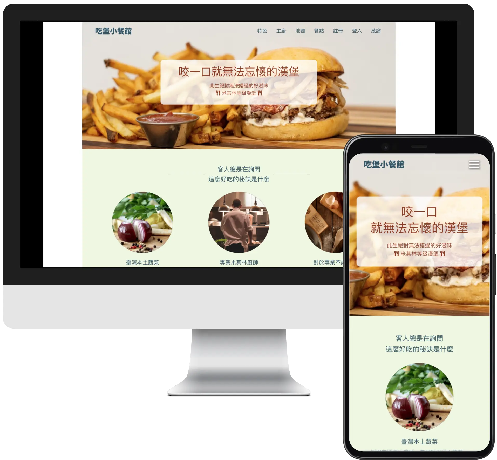
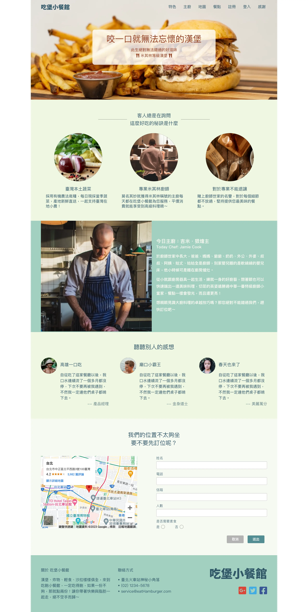
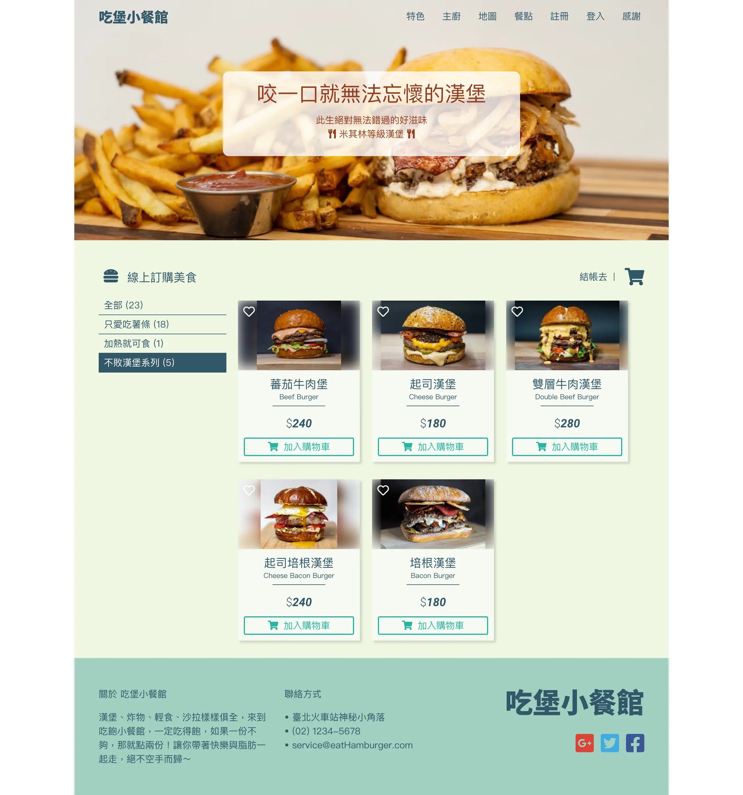
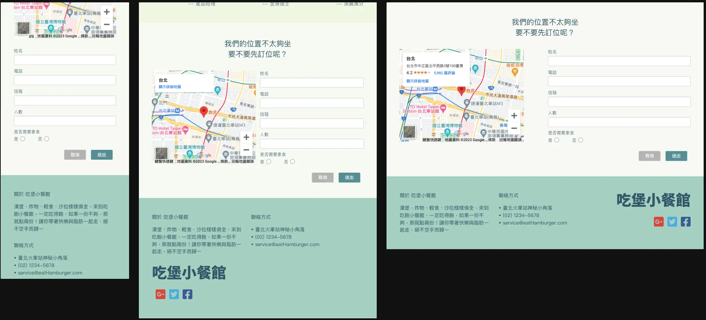
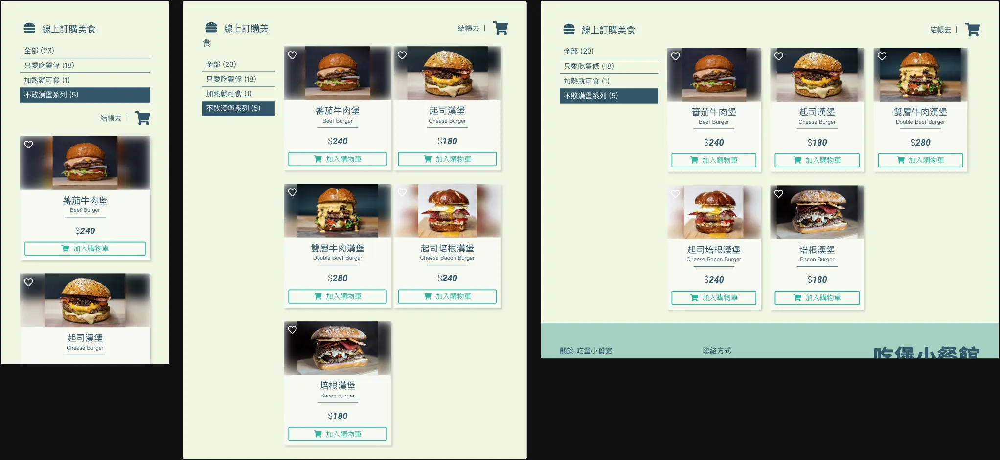
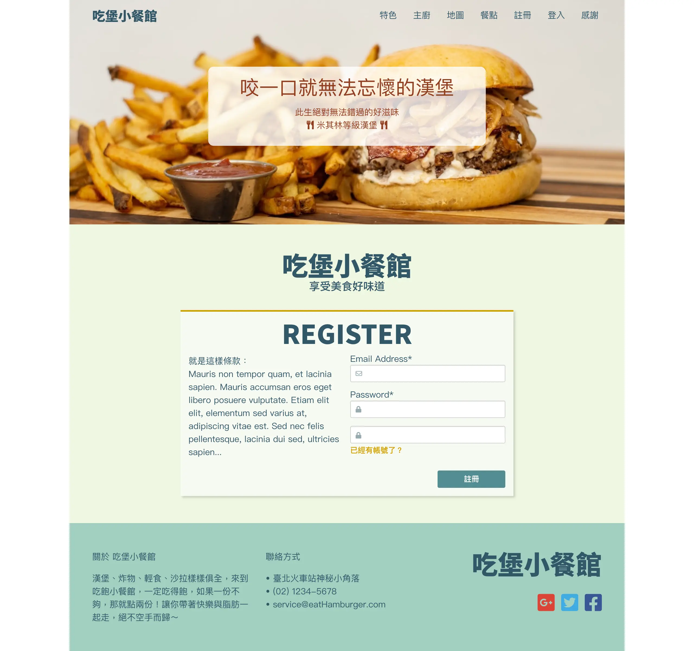
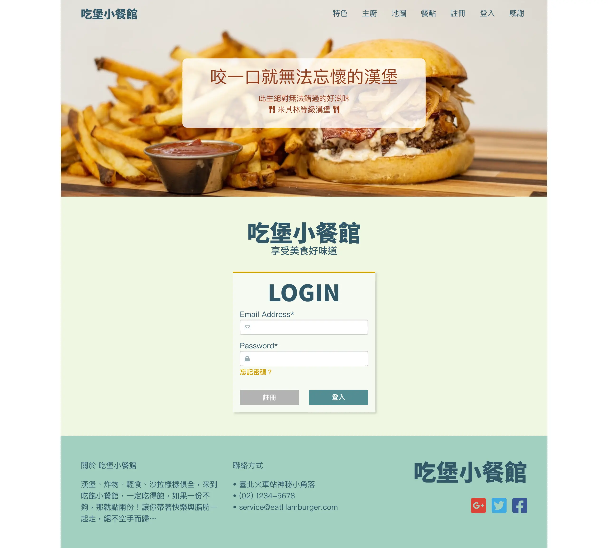

  <h1>吃堡小餐館</h1>
  

    純刻板，未串接 API、未驗證表單
  

  

    <a href="https://yuna9068.github.io/eat-hamburger/">Github Live Site URL</a>
  

## Table of contents

* [Features](#features)
* [Screenshot](#screenshot)
* [Built with](#built-with)
* [Acknowledgments](#acknowledgments)
* [Author](#author)

## Features
* 純刻板
* RWD 響應式網站，主要斷點為 tablet（768px）及 phone（414px）
* 未串接 API、未驗證表單，無法操作表單
* Pug：Includes、Template Inheritance、Mixins

<a href="#readme-top">⬆︎ BACK TO TOP</a>

## Screenshot

<table>
  <tr valign="top">
    <td>
      
首頁

      
    </td>
    <td>
      
餐點頁面

      
    </td>
  </tr>
  <tr valign="top">
    <td>
      
首頁 RWD

      
    </td>
    <td>
      
餐點頁面 RWD

      
    </td>
  </tr>
  <tr valign="top">
    <td>
      
註冊

      
    </td>
    <td>
      
登入

      
    </td>
  </tr>
</table>

<a href="#readme-top">⬆︎ BACK TO TOP</a>

## Built with
* [Pug](https://pugjs.org/api/getting-started.html "Pug")：撰寫頁面
* [Sass](https://sass-lang.com/ "Sass")：設計網站樣式
* [BEM](http://getbem.com/ "BEM")：CSS 設計模式

<a href="#readme-top">⬆︎ BACK TO TOP</a>

## Acknowledgments

* 版面設計參考：[六角學院 - 一變應萬變的響應式網頁設計 作業](https://hexschool.github.io/Rwd_sketch_export/ "六角西餐廳")
* Icon：[Font Awesome 5](https://fontawesome.com/ "Font Awesome 5")
* [蕃茄牛肉堡圖片](https://unsplash.com/photos/sc5sTPMrVfk "蕃茄牛肉堡圖片"), [起司漢堡圖片](https://unsplash.com/photos/9Bqiusimq6M "起司漢堡圖片"), [雙層牛肉漢堡圖片](https://unsplash.com/photos/d-yAWqj-DRg "雙層牛肉漢堡圖片"), [起司培根漢堡圖片](https://unsplash.com/photos/7NYn7YfpaZo "起司培根漢堡圖片"), [培根漢堡圖片](https://unsplash.com/photos/pFWQcon7T_E "培根漢堡圖片") by [amirali mirhashemian](https://unsplash.com/@amir_v_ali "amirali mirhashemian") on [Unsplash](https://unsplash.com "Unsplash")
* [header 圖片](https://unsplash.com/photos/FGGOizCHAvc "header 圖片") by [David Holifield](https://unsplash.com/@davidholifield "David Holifield") on [Unsplash](https://unsplash.com "Unsplash")
* [主廚圖片](https://unsplash.com/photos/llcX9pTjhXM "主廚圖片") by [Ronan Kruithof](https://unsplash.com/@ronank "Ronan Kruithof") on [Unsplash](https://unsplash.com "Unsplash")
* [favicon](https://www.flaticon.com/free-icon/cheese-burger_300645 "favicon") made by [Freepik](https://www.flaticon.com/authors/freepik "Freepik") from [Flaticon](https://www.flaticon.com/ "Flaticon")
* CSS Tools：[Reset CSS](https://meyerweb.com/eric/tools/css/reset/ "Reset CSS")

<a href="#readme-top">⬆︎ BACK TO TOP</a>

## Author

- GitHub - [Yuna](https://github.com/yuna9068)

<a href="#readme-top">⬆︎ BACK TO TOP</a>

